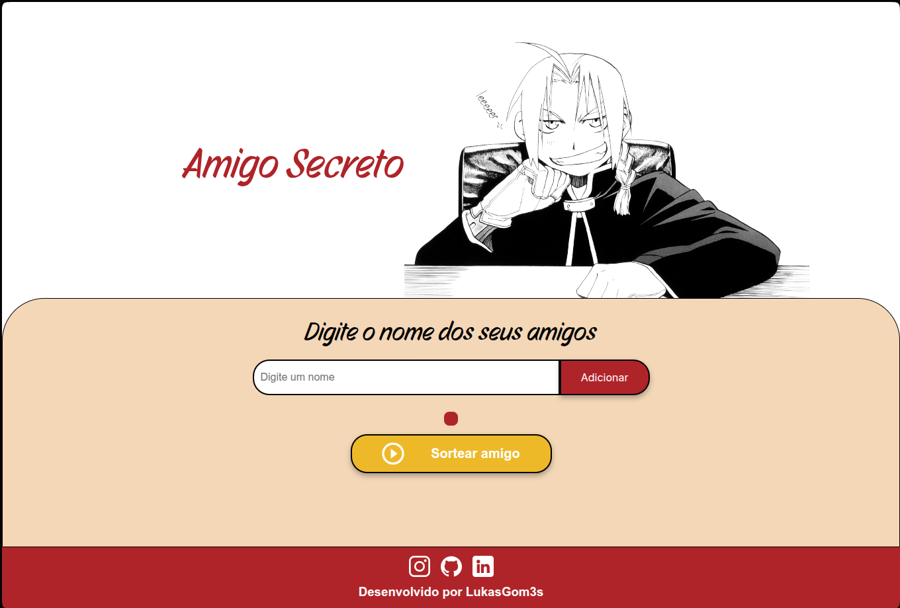

  <!-- Substitua pelo caminho correto da sua logo -->
  

# 🎁 Challenge Amigo Secreto

  
  
  

Aplicação web simples e interativa para realizar sorteios de **Amigo Secreto**, com tema inspirado no personagem **Edward Elric** do anime *Fullmetal Alchemist*.  
Permite adicionar nomes, visualizar a lista de participantes e realizar o sorteio de forma dinâmica.  
Projeto desenvolvido em **HTML, CSS e JavaScript**.

---

## 🚀 Funcionalidades

- **Adicionar amigos** → insira nomes na lista de participantes.  
- **Remover amigos** → delete facilmente qualquer nome da lista.  
- **Lista dinâmica** → os nomes são exibidos automaticamente conforme adicionados.  
- **Validação de entrada** → alerta quando nenhum nome é digitado.  
- **Sorteio aleatório** → seleciona um amigo secreto de forma randômica.  
- **Feedback ao usuário** → mensagens informam se não há nomes suficientes para o sorteio.  
- **Responsividade** → layout adaptado para **PC** e **Mobile**.  

---

## 🛠️ Tecnologias Utilizadas

- **HTML5** → estrutura da aplicação  
- **CSS3** → estilização e responsividade  
- **JavaScript (Vanilla)** → lógica do sorteio e manipulação da lista  
- **Google Fonts** → tipografia personalizada  

---

## 🌐 Demonstração Online

🔗 [Clique aqui para acessar o site](https://challenge-amigo-secreto-ochre.vercel.app/)

---

## 📸 Capturas de Tela

### 💻 Versão Desktop  

### 📱 Versão Mobile  

---

## 👨‍💻 Autor

Desenvolvido por **[LukasGom3s](https://github.com/LukasGom3s)**  
- [Instagram](https://www.instagram.com/luk4s_gom3s)  
- [LinkedIn](https://www.linkedin.com/in/lucasgomesesteves)  

---